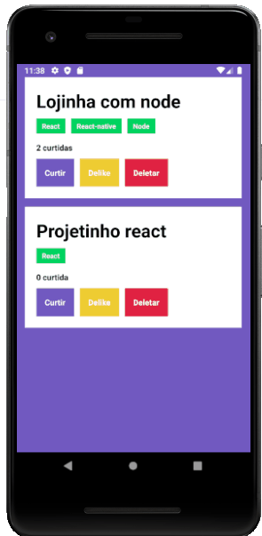

# Atividade react-native GoStack

 Esta atividade foi introdutória nos conceitos do react-native. O intuito do desafio era listar os repositórios juntamente com suas techs e incluir o famoso _Like_. Porém fui um pouco além disso, integrei as funcionalidades de deletar um repositório e adicionei o _delike_. Foi um bom exercício para começar a entender como o react-native funciona.

#### Abaixo seguem as duas funções principais do desafio do GoStack

```javascript

    useEffect(() => {
        api.get('repositories').then(response => {
            setRepositories(response.data);
        })
    }, [])

    async function handleLikeRepository(id) {
        const response = await api.post(`repositories/${id}/like`)
        const findRepoByIndex = repositories.findIndex(repo => repo.id === id)
        repositories[findRepoByIndex] = response.data;
        setRepositories([...repositories]);
    }

```

# Agora segue uma preview do aplicativo

